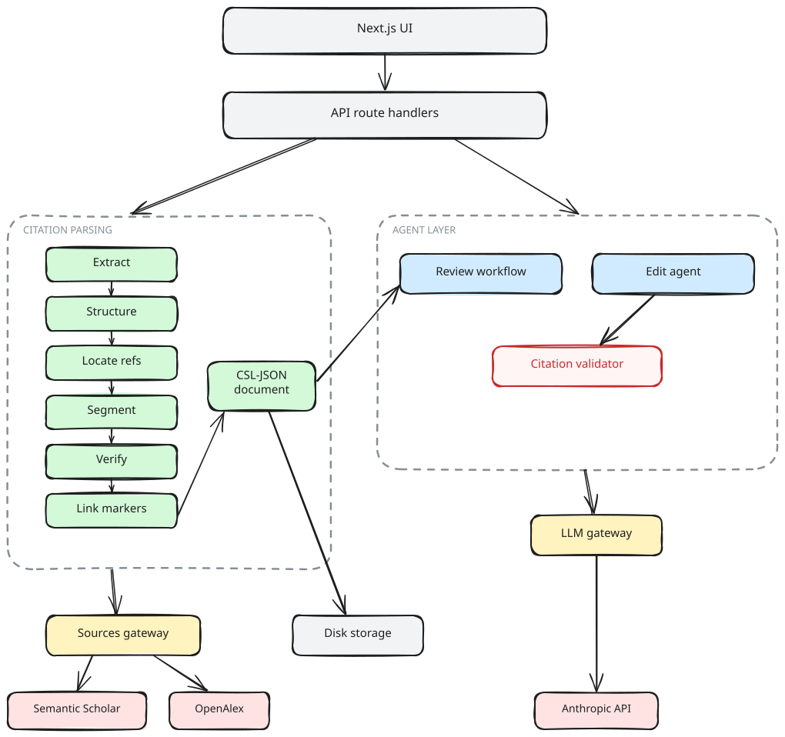

# Paper Improvement Agent

Upload a research paper PDF, get a peer review grounded in real academic search (Semantic Scholar + OpenAlex), and improve the paper with natural-language editing commands — without ever losing a citation.

Built for the AnswerThis founding engineer assessment.

## Run it

```bash
npm install
cp .env.example .env.local   # add your ANTHROPIC_API_KEY
npm run dev                  # http://localhost:3000
```

- `ANTHROPIC_API_KEY` is required for peer review and editing (the agent). Upload and citation parsing work without it.
- `SEMANTIC_SCHOLAR_API_KEY` is optional (higher rate limits); OpenAlex needs no key.
- Test with any real paper — an arXiv PDF works best because its references resolve on both APIs.

```bash
npm test        # vitest unit suite (parsing stages, invariant validator)
npm run lint    # biome
npm run typecheck
```

## What it does

1. **Upload & parse.** A research PDF becomes a structured document through a six-stage pipeline (extract → structure → locate references → segment → parse/resolve → link markers). Every reference is verified against OpenAlex/Semantic Scholar into CSL-JSON with a clickable source link; every in-text marker is bound to its entry. Unparseable entries, orphan markers, and never-cited references are surfaced, not dropped.
2. **Peer review, on request.** Streams reviewer-style findings: relevant work the paper doesn't cite (year-filtered — nothing newer than the paper), and claim–citation checks judging each citing sentence against the cited work's real abstract. High-severity accusations must survive an adversarial re-check, and every verdict carries a verbatim abstract quote validated in code. Empty searches and skipped entries appear as process notes.
3. **Edit by instruction.** "Make the introduction more concise" or "add supporting citations to section 2" runs a tool-use agent that proposes typed operations, shown as word-level diffs for approval. A deterministic validator (in the loop *and* at approval) rejects any edit that would lose a citation, cite a nonexistent entry, or add an unverified source — new references can only come from the agent's own verified search results.
4. **Export.** Rebuilds the paper as compilable LaTeX (verified with tectonic) with `\cite` keys and a citeproc/CSL-rendered bibliography, plus a BibTeX file and a structured Markdown version (headings, reconstructed tables, rendered reference list). Structure, approved edits, and all references survive the round trip.

Tested end-to-end on arXiv 1706.03762 ("Attention Is All You Need"): 40/41 references verified with links, 102→71 markers after footnote/math de-noising, and the reviewer independently caught the paper's known byte-pair-encoding mis-citation ([3] Britz et al. instead of Sennrich et al.).

## System design



See [docs/SYSTEM_DESIGN.md](docs/SYSTEM_DESIGN.md) — covers the citation-parsing pipeline (PDF → CSL-JSON) and the agent architecture (peer review + natural-language editing). The diagram source is editable at [excalidraw.com](https://excalidraw.com) via [docs/architecture.excalidraw](docs/architecture.excalidraw).

## Where AI tools were used

This project was built with AI coding tools driving implementation, with all decisions reviewed and directed in conversation.

- **AI-written**: essentially all code and documentation drafts, generated phase by phase under human direction.
- **Human-directed and verified**: the phase plan and scope decisions (framework rejection, no-DB/no-auth, filesystem storage), tooling conventions (Biome/lefthook/commitlint mirrored from an existing project), API budget/model choices, and review of every proposal before it was committed.
- **Verified against reality, not just tests**: every phase was exercised live on a real arXiv paper before being committed — that testing caught and fixed real bugs the unit tests alone would not have (the arXiv watermark hijacking title detection, footnote/math superscripts fabricating citation links, judge false positives on abstract-only evidence, API rate-limit handling).
- The app's own outputs were spot-checked by hand: verified reference links were opened, the flagged BPE mis-citation was confirmed against the literature, and the exported LaTeX was compiled to PDF.

## Known limitations

- Scanned PDFs (no text layer) are rejected with an explicit failure; OCR is not supported.
- Footnote and figure-caption text can merge into body paragraphs (font-size-based block classification is future work; spans are already preserved to enable it).
- Aligned-column tables are reconstructed into real tables (a pdf-inspector-inspired heuristic); irregular or drawn-grid tables and mathematical formulas still extract as debris, which the reader de-emphasizes rather than hides.
- Two-column layouts are split at the column gutter per line; an 11-paper audit (arXiv, IEEE Access, MDPI, Springer layouts) parses with zero citation-integrity violations. Unusual mixed layouts (sidebars, three columns) can still locally misorder text.
- Author-year linking reports ambiguity honestly: a cite matching multiple entries (or an entry the segmenter missed) becomes a visible orphan, never a guessed link.
- Semantic Scholar's unauthenticated pool rate-limits aggressively (HTTP 429). Batch requests mostly avoid this; when it still hits, upload-time resolution stops at a 90s time budget, affected entries stay honestly "unverified" with the real cause, and the in-place "Retry verification" action (or an optional `SEMANTIC_SCHOLAR_API_KEY`) heals them.
- Heading detection now reads bold weights from font PostScript names (a pdf-inspector-inspired technique), so bold body-size headings are caught; fonts with nondescript names can still hide their weight.
- Claim checking judges against the cited work's *abstract* (full texts are not fetched). Abstracts omit details, so the checker can over-flag broad or detail-heavy claims even with prompting toward "cannot-tell"; verdicts are surfaced with confidence levels and severity so the author stays the judge.
- Missing-work review correctly refuses to suggest papers published after the reviewed paper — reviewing an older classic therefore legitimately yields few or no missing-work findings.

## With more time

- Deploying to Vercel: the app builds and runs, but `data/` filesystem storage is ephemeral on serverless — a deployed instance needs the storage swap below before papers persist across requests/instances.
- Production path: Postgres + object storage for papers, authenticated multi-tenant workspaces, Redis-backed job queue for long-running reviews (today reviews already checkpoint after every work unit and resume across refreshes; a queue would detach them from the HTTP connection entirely); schema versioning for stored documents (today old documents are handled defensively and healed by re-upload).
- Claim checking against full texts (DeepSciVerify-style escalation) instead of abstracts only.
- Vendored `.csl` style files (IEEE, ACM) beyond citation-js's bundled APA/Vancouver/Harvard, with user style pick in the export panel.
- An end-to-end PDF fixture test (a small committed LaTeX-built paper) exercising P1→P6 in CI.
- ML-based reference parsing (GROBID/anystyle-class) for wild citation styles, layered under the same verification pipeline. Firecrawl's open-source pdf-inspector (Rust, multi-column aware, scanned-PDF detection) is a candidate P1 replacement for production — though its markdown output would need span-level layout retained for marker linking, which is why P1 stays custom here.
- Batch API for offline bulk review of many papers; the agent layer ports cleanly to eve or Cloudflare's Agents SDK if durable sessions were ever needed.
